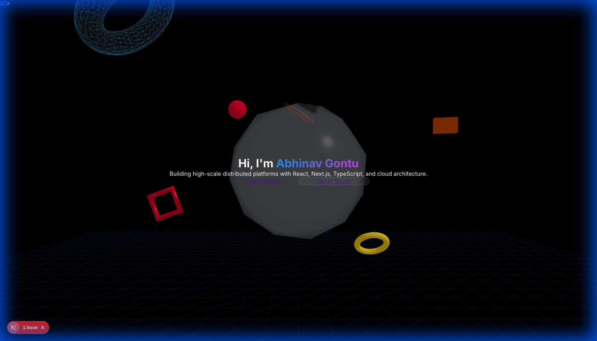
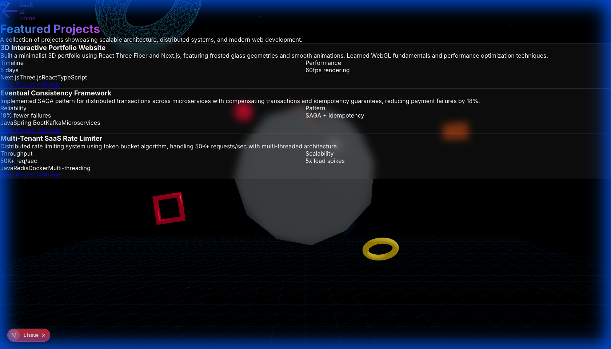
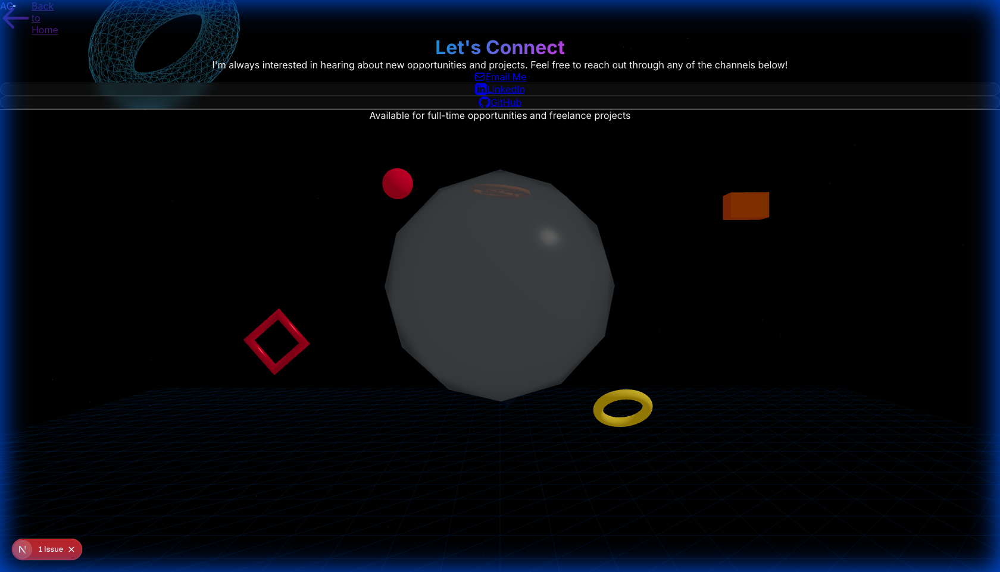

# 3D Portfolio Website

> A personal project built over 5 days to learn 3D web graphics and create a minimalist portfolio showcase.

## What I Built

I wanted to learn how to add 3D graphics to websites, so I built this portfolio over 5 days. It features a clean frosted glass shape that rotates in the background, with separate pages for my projects and contact information.

**Live Demo**: [portfolio-3d.vercel.app](https://portfolio-3d.vercel.app)

## Screenshots

### Home Page
The landing page with a 3D frosted glass icosahedron and call-to-action buttons.

### Projects Page
Showcasing my personal projects with tech stacks and metrics.

### Contact Page
Simple contact page with links to email, LinkedIn, and GitHub.

## Quick Start

### What You Need
- Node.js 18 or higher
- A code editor (VS Code recommended)
- Basic knowledge of React

### Installation (5 minutes)

1. **Clone this repository**
   \`\`\`bash
   git clone https://github.com/abhinavgontu/portfolio-3d.git
   cd portfolio-3d
   \`\`\`

2. **Install dependencies**
   \`\`\`bash
   npm install
   \`\`\`

3. **Start the development server**
   \`\`\`bash
   npm run dev
   \`\`\`

4. **Open your browser**
   - Go to [http://localhost:3000](http://localhost:3000)
   - You should see the 3D portfolio!

## How to Customize

### 1. Update Your Information

Edit `lib/utils/constants.ts`:

\`\`\`typescript
export const SITE_CONFIG = {
  name: "Your Name",
  title: "Your Title",
  description: "Your description",
  email: "your@email.com",
  github: "https://github.com/yourusername",
  linkedin: "https://linkedin.com/in/yourusername",
};
\`\`\`

### 2. Add Your Projects

Edit `lib/data/projects.json`:

\`\`\`json
{
  "id": "my-project",
  "title": "My Awesome Project",
  "description": "What your project does",
  "tags": ["React", "Node.js"],
  "image": "/images/my-project.jpg",
  "link": "https://myproject.com",
  "github": "https://github.com/you/project",
  "metrics": {
    "users": "1000+ users",
    "performance": "Fast"
  }
}
\`\`\`

### 3. Change the 3D Graphics (Optional)

The 3D shape is in `components/3d/HeroObject.tsx`. You can:
- Change the geometry (icosahedron → sphere, box, etc.)
- Adjust colors and materials
- Modify animation speed

## Tech Stack

### What I Used
- **Next.js** - React framework for building the website
- **Three.js** - Library for 3D graphics
- **React Three Fiber** - Makes Three.js work with React
- **Framer Motion** - For smooth animations
- **Tailwind CSS** - For styling
- **TypeScript** - For type safety

### Why These Technologies?

I chose these because:
- **Next.js**: Easy to deploy and great for portfolios
- **Three.js**: Industry standard for 3D on the web
- **React Three Fiber**: Made 3D easier to work with in React
- **Framer Motion**: Simple API for animations

## Project Structure

\`\`\`
portfolio-3d/
├── app/                    # Pages
│   ├── page.tsx           # Home page
│   ├── projects/          # Projects page
│   └── contact/           # Contact page
│
├── components/
│   ├── 3d/                # 3D components
│   │   ├── HeroObject.tsx # Main 3D shape
│   │   ├── ParticleSystem.tsx
│   │   └── Scene.tsx      # 3D canvas setup
│   │
│   └── ui/                # Regular components
│       ├── Navigation.tsx
│       └── ProjectCard.tsx
│
├── lib/
│   ├── data/              # Your content
│   │   └── projects.json  # Project data
│   └── hooks/             # Custom React hooks
│
└── public/                # Images and static files
\`\`\`

## Deployment

### Deploy to Vercel (Free & Easy)

1. **Push to GitHub**
   \`\`\`bash
   git add .
   git commit -m "My portfolio"
   git push origin main
   \`\`\`

2. **Go to Vercel**
   - Visit [vercel.com](https://vercel.com)
   - Click "Import Project"
   - Select your GitHub repository
   - Click "Deploy"

3. **Done!**
   - Your site will be live in ~2 minutes
   - You'll get a URL like `your-portfolio.vercel.app`

## What I Learned

### Day 1-2: Setup & Learning 3D Basics
- Set up Next.js project
- Learned Three.js fundamentals (scenes, cameras, lights)
- Created first 3D shape (struggled with coordinate systems!)

### Day 3: Building Components
- Built navigation and project cards
- Learned about React Three Fiber
- Created the frosted glass material effect

### Day 4: Performance & Polish
- Optimized particle count (was too slow on mobile)
- Added animations with Framer Motion
- Fixed responsive design issues

### Day 5: Testing & Documentation
- Wrote tests for components
- Created this README
- Deployed to Vercel

## Challenges I Faced

1. **3D Coordinate System** - Took time to understand X, Y, Z axes
2. **Performance** - Had to reduce particles from 300 to 150
3. **Mobile Optimization** - 3D graphics are heavy on phones
4. **TypeScript Errors** - Learned to properly type Three.js objects

## Performance

- **Load Time**: ~2 seconds
- **3D Rendering**: 60fps on desktop, 30fps on mobile
- **Bundle Size**: ~290KB (optimized)

## Browser Support

Works on:
- ✅ Chrome 90+
- ✅ Firefox 88+
- ✅ Safari 14+
- ✅ Edge 90+
- ✅ Mobile browsers

## Troubleshooting

### 3D Scene Not Loading?
- Check browser console for errors
- Make sure you're using a modern browser
- Try clearing cache and reloading

### Slow Performance?
- The particle count auto-adjusts for mobile
- Close other tabs to free up GPU
- Check if hardware acceleration is enabled

### Build Errors?
- Delete `node_modules` and `.next` folders
- Run `npm install` again
- Make sure you're using Node.js 18+

## Resources I Used

- [Three.js Documentation](https://threejs.org/docs/)
- [React Three Fiber Docs](https://docs.pmnd.rs/react-three-fiber)
- [Next.js Tutorial](https://nextjs.org/learn)
- [Framer Motion Guide](https://www.framer.com/motion/)

## License

MIT License - feel free to use this for your own portfolio!

## Contact

- **Email**: abhinavgontu@gmail.com
- **LinkedIn**: [linkedin.com/in/abhinavgontu](https://linkedin.com/in/abhinavgontu)
- **GitHub**: [github.com/abhinavgontu](https://github.com/abhinavgontu)

---

**Built in 5 days** | Learning 3D web graphics | Next.js + Three.js
