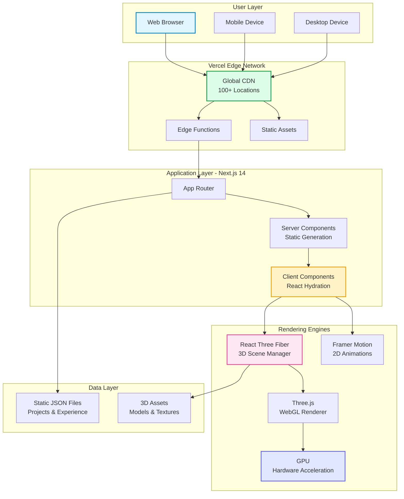
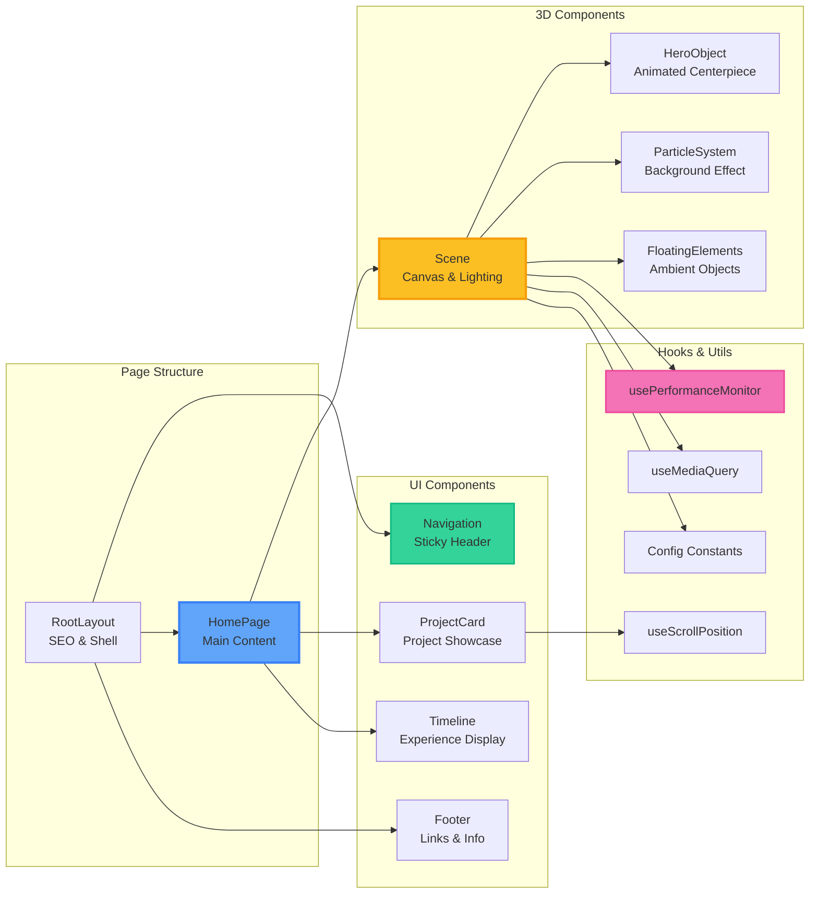
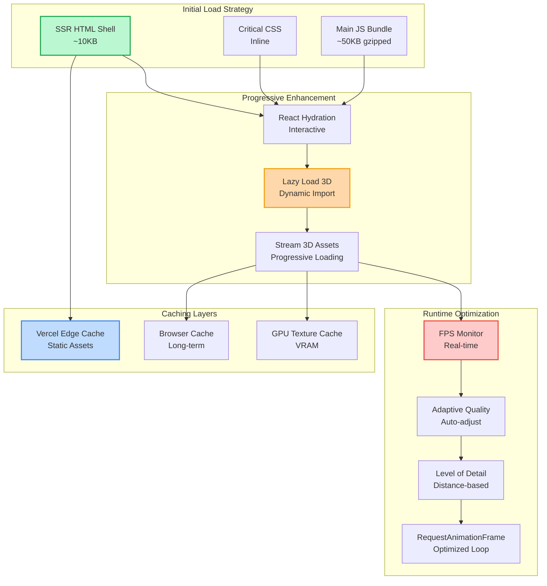
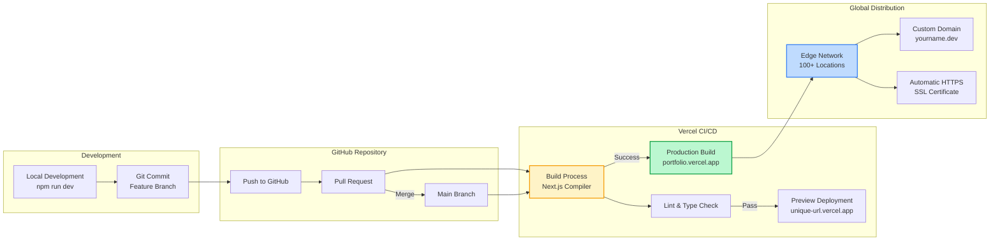

# Architecture Documentation

## System Overview

This document provides a comprehensive overview of the 3D Portfolio Website architecture, including system design, component hierarchy, data flow, and deployment strategy.

---

## High-Level Architecture



---

## Component Architecture



---

## Data Flow Architecture

```mermaid
sequenceDiagram
    participant User
    participant Browser
    participant Vercel
    participant Next.js
    participant 3D Engine
    participant GPU
    
    User->>Browser: Navigate to portfolio
    Browser->>Vercel: HTTPS Request
    Vercel->>Next.js: Route /<br/>(SSR/SSG)
    
    Next.js->>Next.js: Generate HTML<br/>(Server Components)
    Next.js-->>Vercel: HTML + Metadata
    Vercel-->>Browser: Initial HTML<br/>(<1s)
    
    Browser->>Browser: Parse HTML
    Browser->>Vercel: Request JS bundles
    Vercel-->>Browser: Code chunks<br/>(code-split)
    
    Browser->>Next.js: Hydrate React
    Next.js->>3D Engine: Initialize R3F Canvas
    3D Engine->>GPU: Create WebGL Context
    GPU->>GPU: Compile Shaders
    
    loop 60fps Animation
        3D Engine->>GPU: Render Frame
        GPU->>3D Engine: Frame Buffer
        3D Engine->>Browser: Display
    end
    
    User->>Browser: Scroll Page
    Browser->>3D Engine: Scroll Event
    3D Engine->>GPU: Update Scene
    GPU-->>Browser: New Frame
    
    Note over Browser,GPU: Total Time to Interactive: <3.5s
    
    style Browser fill:#dbeafe,stroke:#3b82f6
    style 3D Engine fill:#fce7f3,stroke:#ec4899
    style GPU fill:#d1fae5,stroke:#10b981
```

---

## Performance Architecture



---

## File Organization

```
portfolio-3d/
│
├── app/                           # Next.js App Router
│   ├── layout.tsx                # Root layout, SEO metadata
│   ├── page.tsx                  # Home page with all sections
│   ├── globals.css               # Tailwind + custom styles
│   └── favicon.ico               # Site icon
│
├── components/
│   ├── 3d/                       # React Three Fiber components
│   │   ├── Scene.tsx             # Canvas wrapper, lighting setup
│   │   ├── HeroObject.tsx        # Main animated 3D object
│   │   ├── ParticleSystem.tsx    # Background particle effects
│   │   └── FloatingElements.tsx  # Ambient floating objects
│   │
│   ├── ui/                       # User interface components
│   │   ├── Navigation.tsx        # Sticky nav with glassmorphism
│   │   ├── ProjectCard.tsx       # Project showcase cards
│   │   ├── Timeline.tsx          # Experience timeline
│   │   └── Footer.tsx            # Site footer
│   │
│   └── animations/               # Animation wrappers (future)
│
├── lib/
│   ├── hooks/                    # Custom React hooks
│   │   ├── useScrollPosition.ts  # Track scroll for parallax
│   │   ├── useMediaQuery.ts      # Responsive breakpoints
│   │   └── usePerformanceMonitor.ts  # FPS tracking
│   │
│   ├── utils/                    # Utility functions
│   │   ├── constants.ts          # App-wide constants
│   │   └── three-helpers.ts      # Three.js utilities (future)
│   │
│   └── data/                     # Content as data
│       ├── projects.json         # Project metadata
│       ├── experience.json       # Work history
│       └── skills.json           # Skills taxonomy (future)
│
├── public/                       # Static assets
│   ├── models/                   # 3D model files (.glb, .gltf)
│   ├── textures/                 # Texture images
│   └── images/                   # Project screenshots
│
├── docs/                         # Documentation
│   ├── ARCHITECTURE.md           # This file
│   ├── COMPONENTS.md             # Component API docs
│   ├── PERFORMANCE.md            # Performance guide
│   └── WORKFLOWS.md              # Development workflows
│
├── next.config.ts                # Next.js configuration
├── tailwind.config.ts            # Tailwind CSS config
├── tsconfig.json                 # TypeScript config
├── package.json                  # Dependencies
└── README.md                     # Project overview
```

---

## Technology Stack Justification

### Why Next.js 14?
- ✅ Built-in SSR/SSG for SEO
- ✅ Image optimization
- ✅ Zero-config deployment to Vercel
- ✅ App Router for modern patterns
- ✅ Automatic code splitting

### Why React Three Fiber?
- ✅ Declarative 3D in React
- ✅ Hooks-based API
- ✅ Automatic memory management
- ✅ Performance optimizations
- ✅ Large ecosystem (drei, postprocessing)

### Why Framer Motion?
- ✅ Best-in-class animation library
- ✅ Spring physics
- ✅ Gesture support
- ✅ Layout animations
- ✅ Optimized for performance

### Why Tailwind CSS?
- ✅ Utility-first approach
- ✅ Rapid prototyping
- ✅ Tree-shaking (small bundle)
- ✅ Consistent design system
- ✅ Mobile-first responsive

---

## Deployment Architecture



---

## Security & Best Practices

### Security Measures
1. **HTTPS Enforced** - Automatic SSL via Vercel
2. **Security Headers** - CSP, X-Frame-Options, etc.
3. **XSS Protection** - React escaping
4. **Input Sanitization** - Form validation
5. **No Sensitive Data** - Static site, no secrets

### Performance Best Practices
1. **Code Splitting** - Dynamic imports for heavy components
2. **Image Optimization** - Next/Image with WebP
3. **Lazy Loading** - Below-fold content
4. **Adaptive Quality** - FPS-based rendering adjustments
5. **CDN Caching** - Static assets cached globally

### Accessibility
1. **Semantic HTML** - Proper heading hierarchy
2. **ARIA Labels** - For 3D scene context
3. **Keyboard Navigation** - Tab-accessible
4. **Color Contrast** - WCAG AA compliant
5. **Reduced Motion** - Respects user preference

---

## Future Enhancements

### Phase 2 Features
- [ ] CMS integration (Sanity/Contentful)
- [ ] Blog with MDX support
- [ ] Advanced 3D models (GLTF imports)
- [ ] VR mode (WebXR)
- [ ] Dark/Light theme toggle
- [ ] i18n support (multiple languages)
- [ ] Analytics dashboard
- [ ] A/B testing framework

### Performance Targets
- Lighthouse Score: 95+ (all categories)
- LCP: <1.5s
- FID: <50ms
- CLS: <0.05

---

**Last Updated**: January 2026  
**Version**: 1.0.0
