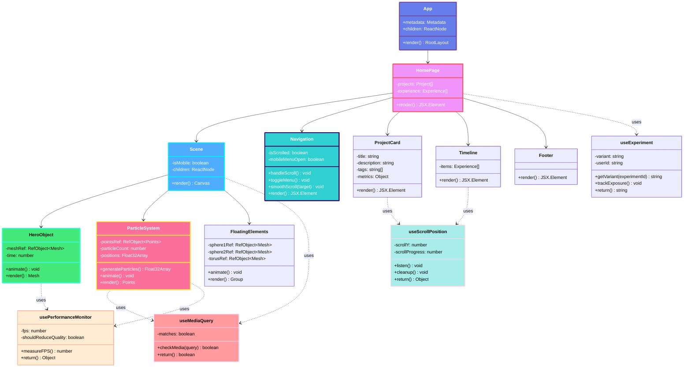
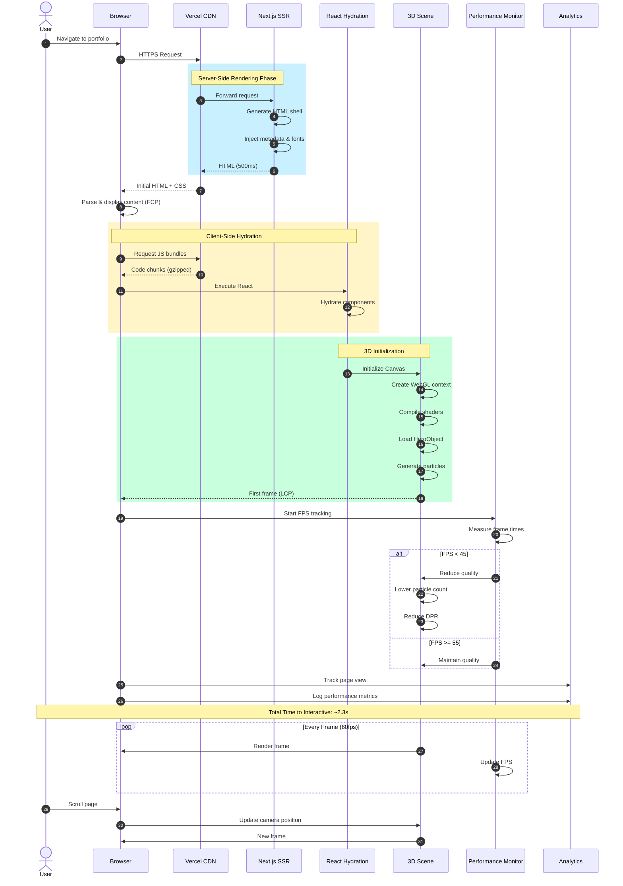
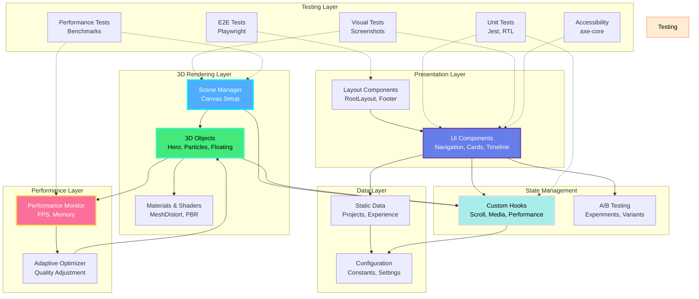
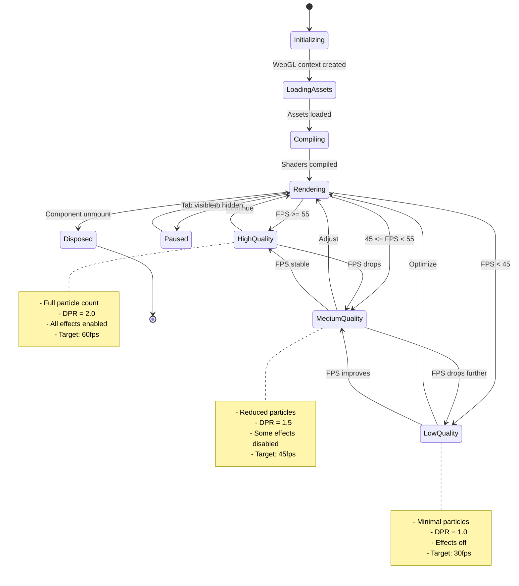
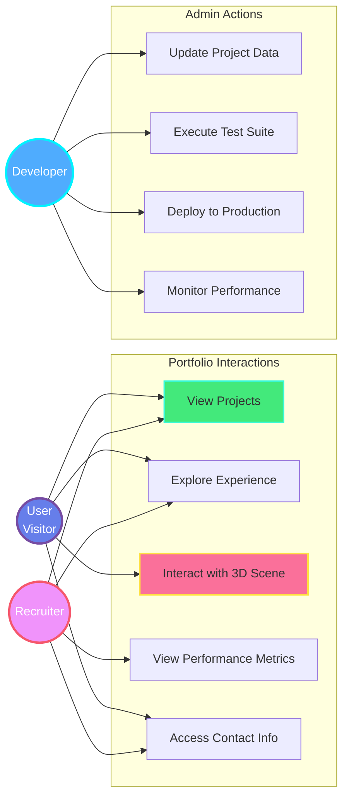
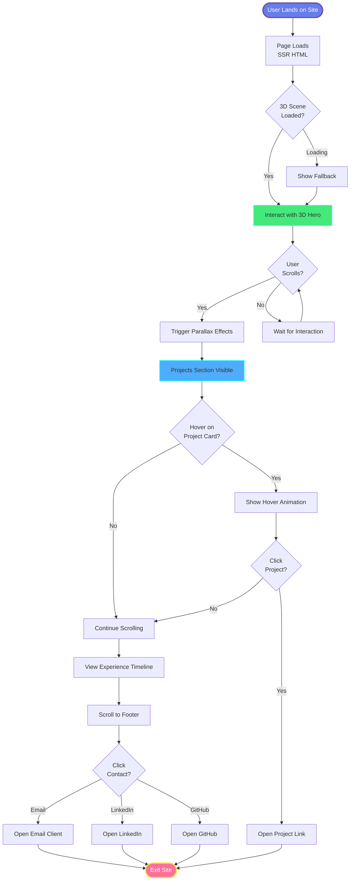
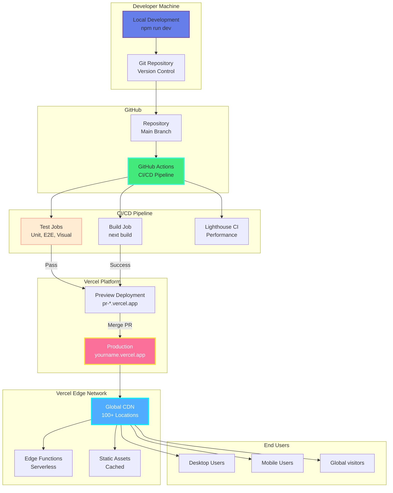

# UML Diagrams - 3D Portfolio Website

Comprehensive visual documentation of the system architecture using UML diagrams.

---

## 1. Class Diagram - Component Architecture

---

## 2. Sequence Diagram - Page Load Flow

---

## 3. Component Diagram - System Modules

---

## 4. State Diagram - 3D Scene Lifecycle

---

## 5. Use Case Diagram - User Interactions

---

## 6. Activity Diagram - User Journey

---

## 7. Deployment Diagram - Infrastructure

---

## Diagram Legend

### Color Scheme

- 🟣 **Purple Gradient** - Main application layers
- 🔵 **Blue Gradient** - 3D rendering components
- 🟢 **Green Gradient** - Performance & optimization
- 🔴 **Pink/Red Gradient** - Critical paths
- 🟡 **Yellow/Orange** - Testing & QA

### Arrow Types

- **Solid arrows** (→) - Direct dependencies
- **Dashed arrows** (-->) - Uses/References
- **Dotted arrows** (...>) - Tests/Validates

---

**Last Updated**: January 2026  
**Diagram Count**: 7 comprehensive UML diagrams
