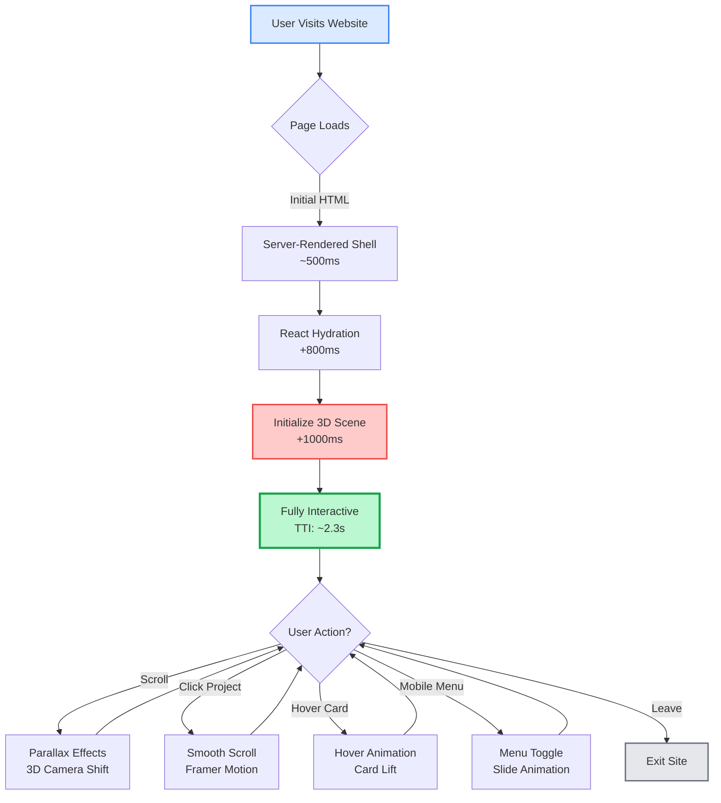
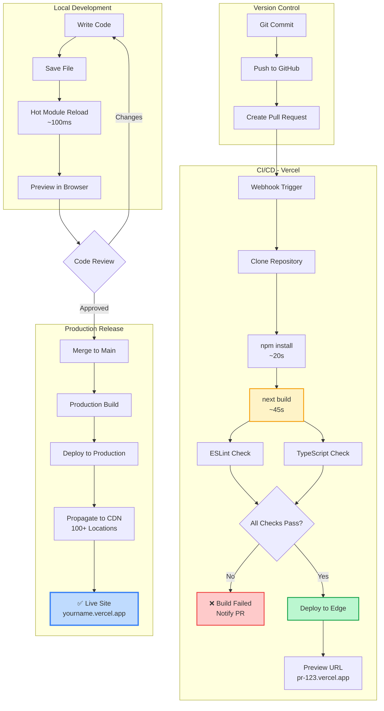
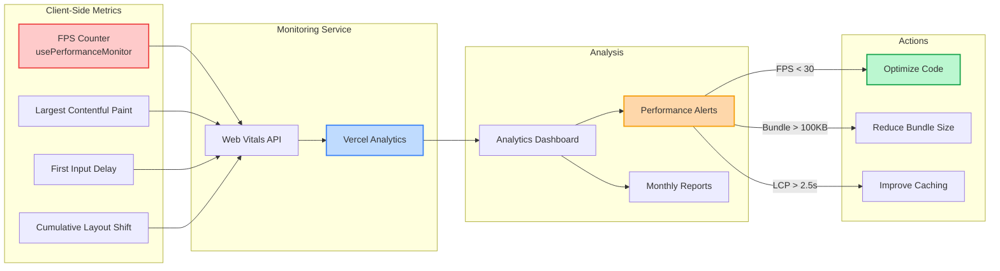
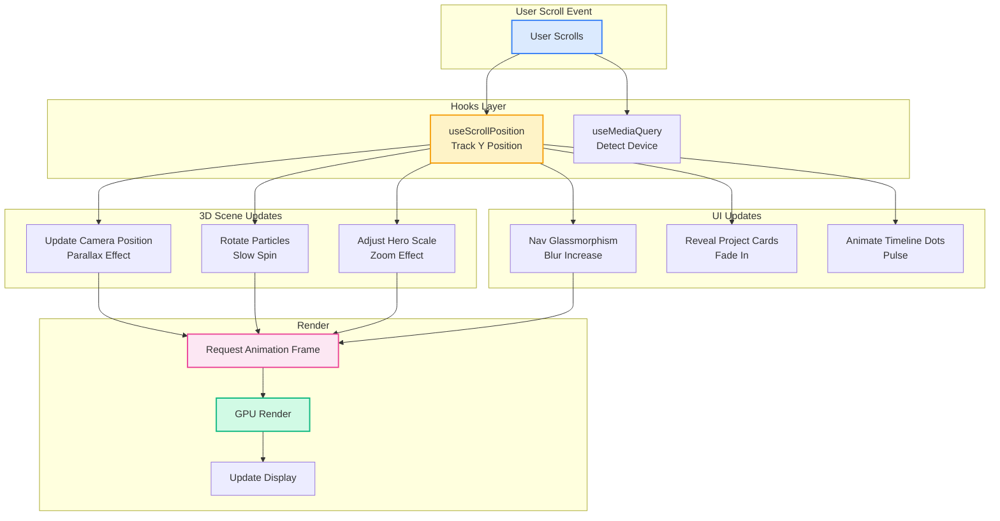
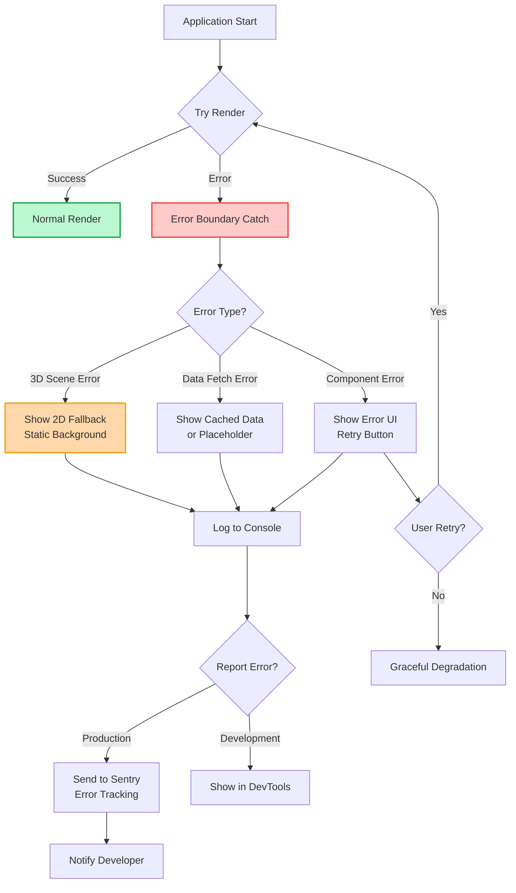

# Workflows Documentation

This document visualizes the key workflows and processes within the 3D Portfolio Website, from user interactions to build/deployment pipelines.

---

## User Journey Workflow



---

## 3D Rendering Pipeline

```mermaid
sequenceDiagram
    autonumber
    participant Component as React Component
    participant R3F as React Three Fiber
    participant Three as Three.js
    participant WebGL as WebGL Context
    participant GPU as Graphics GPU
    
    Component->>R3F: Render <Scene>
    R3F->>Three: Create Scene Object
    R3F->>Three: Add Camera
    R3F->>Three: Add Lights
    
    Component->>R3F: Render <HeroObject>
    R3F->>Three: Create Mesh + Geometry
    Three->>WebGL: Compile Shaders
    WebGL->>GPU: Upload to VRAM
    
    Component->>R3F: Render <ParticleSystem>
    R3F->>Three: Create Points
    Three->>WebGL: Generate Buffers
    
    loop Every Frame (60fps)
        R3F->>Component: useFrame() callback
        Component->>Three: Update transforms
        Three->>WebGL: Render scene
        WebGL->>GPU: Draw call
        GPU-->>WebGL: Frame buffer
        WebGL-->>R3F: Rendered frame
        R3F-->>Component: Display
    end
    
    Note over Component,GPU: Frame Budget: 16.67ms @ 60fps
    
    style R3F fill:#fef3c7,stroke:#f59e0b,stroke-width:2px
    style Three fill:#fce7f3,stroke:#ec4899,stroke-width:2px
    style GPU fill:#d1fae5,stroke:#10b981,stroke-width:2px
```

---

## Animation Timeline Workflow

```mermaid
gantt
    title Page Load Animation Sequence
    dateFormat  X
    axisFormat  %Ls
    
    section Initial Load
    HTML Shell           :0, 500ms
    CSS Parse           :0, 300ms
    JS Download         :100ms, 600ms
    
    section Hydration
    React Mount         :700ms, 400ms
    
    section 3D Scene
    Canvas Init         :1100ms, 300ms
    Shader Compile      :1400ms, 400ms
    Asset Load          :1400ms, 600ms
    First Frame         :milestone, 2000ms, 0ms
    
    section UI Animations
    Nav Slide In        :500ms, 600ms
    Hero Fade In        :1100ms, 600ms
    Projects Reveal     :2000ms, 800ms
    
    section Interactive
    TTI Complete        :milestone, 2300ms, 0ms
```

---

## Build & Deployment Workflow



---

## Performance Monitoring Workflow



---

## Component Interaction Workflow



---

## Content Update Workflow

```mermaid
flowchart LR
    subgraph "Update Content"
        Edit[Edit projects.json<br/>or experience.json]
        Save[Save File]
    end
    
    subgraph "Git Process"
        Commit[Git Commit]
        Push[Push to GitHub]
    end
    
    subgraph "Automatic Build"
        Trigger[Vercel Webhook]
        Build[Next.js Build<br/>Static Generation]
        Optimize[Optimize JSON]
    end
    
    subgraph "Deployment"
        Deploy[Deploy to Edge]
        Invalidate[Invalidate Cache]
        Live[Live Update]
    end
    
    Edit --> Save
    Save --> Commit
    Commit --> Push
    Push --> Trigger
    Trigger --> Build
    Build --> Optimize
    Optimize --> Deploy
    Deploy --> Invalidate
    Invalidate --> Live
    
    style Build fill:#fef3c7,stroke:#f59e0b,stroke-width:2px
    style Live fill:#bbf7d0,stroke:#16a34a,stroke-width:2px
```



---

## Error Handling Workflow



---

## Development Workflow Phases

### Phase 1: Local Development
1. Clone repository
2. Install dependencies (`npm install`)
3. Start dev server (`npm run dev`)
4. Make changes with HMR feedback
5. Test in browser (Chrome DevTools)

### Phase 2: Quality Assurance
1. Run linter (`npm run lint`)
2. Run type checker (`tsc --noEmit`)
3. Test responsive design (DevTools device emulation)
4. Check accessibility (Lighthouse)
5. Test 3D performance (FPS counter)

### Phase 3: Version Control
1. Create feature branch
2. Commit changes with descriptive messages
3. Push to GitHub
4. Create pull request
5. Wait for CI/CD checks

### Phase 4: Deployment
1. Review preview deployment
2. Merge to main branch
3. Automatic production build
4. Edge network propagation
5. Verify live site

---

**Last Updated**: January 2026  
**Version**: 1.0.0
